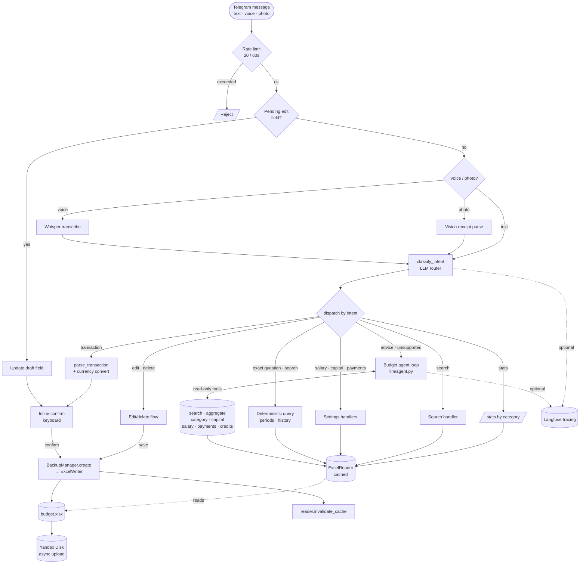

# Telegram Budget Helper

A personal finance Telegram bot that understands natural-language messages, photo receipts, and voice. It classifies intent with an LLM router, writes confirmed transactions to an Excel file, and syncs with Yandex Disk. Powered by OpenRouter (Gemini / GPT-4o / Claude, configurable).

---

## Features

- **Smart intent routing** — LLM classifier routes every message to the right handler automatically
- **Natural language transactions** — type "coffee 200" and it becomes a structured transaction; confirm with one tap
- **Transaction search** — natural-language search by description/category/month with newest-first results
- **Auditable transaction edit/delete** — confirmed rows are append-only; edits create reversal+replacement entries and deletes create reversals
- **Photo receipts** — send a photo of a receipt; a vision model extracts amount, description, category
- **Voice transcription (optional)** — voice messages transcribed via Whisper, then handled like text (disabled if `WHISPER_API_KEY` is not set)
- **Deterministic-first analytics** — exact periods, expense summaries, and historical start-of-day balances run as typed Excel queries; complex analysis/advice falls back to the tool-calling agent
- **Salary & capital** — query or update salary and total capital; `/salary` computes the net amount for the next payment date using either working days or fixed configured percentages; `/update_capital` rebuilds salary projection columns, and capital queries show the current actual balance plus future projections without storing projected balances as actual capital
- **Setup wizard** — admin-only `/setup` creates or updates the runtime workbook at `BUDGET_FILE_PATH` from the sanitized public template
- **Payments checklist** — ask "what do I need to pay?" and get a ☐ checklist from your payments sheet
- **Agent tips** — `/tip <text>` saves persistent formatting/behaviour hints the agent applies on every invocation
- **Safe unknown handling** — unknown financial questions are routed to the budget agent; an optional sandboxed Python tool stays disabled by default
- **Excel ledger backend** — all data and audit history live in one structured `.xlsx`; SQLite is not required
- **Yandex Disk sync** — uploaded on every confirmed transaction, refreshed locally on `/sync`, sent to chat on `/download_excel`
- **Auto-backups** — local rotating backups before every write
- **Langfuse tracing** — optional LLM observability (gracefully skipped if unavailable)

---

## How it works

Every incoming Telegram message is rate-limited, then routed by an LLM intent
classifier to the matching handler. Transactions go through a confirm step before
they touch Excel. Exact analytical questions run through a deterministic query
layer; unsupported analysis and advice fall back to the tool-calling agent.
Confirmed writes append ledger events, are backed up locally, and sync to Yandex Disk.



---

## Requirements

- Python 3.12+
- A Telegram bot token ([BotFather](https://t.me/BotFather))
- An [OpenRouter](https://openrouter.ai/) API key (or any OpenAI-compatible endpoint)
- A Yandex Disk OAuth token ([get one](https://yandex.ru/dev/disk/poligon/))
- (Optional) A Whisper-compatible API for voice transcription
- (Optional) [Langfuse](https://langfuse.com/) for LLM tracing

## License

MIT License. See [LICENSE](LICENSE).

---

## Setup / Установка

### 1. Clone & install dependencies

```bash
git clone https://github.com/nikultimo/HouseholdBudgetHelper.git
cd TelegramBudgetHelper
pip install -r requirements.txt
```

### 2. Configure environment variables

Copy `.env.example` to `.env` and fill in your values:

```bash
cp .env.example .env
```

| Variable | Description |
|---|---|
| `TELEGRAM_TOKEN` | Bot token from BotFather |
| `OPENROUTER_API_KEY` | OpenRouter (or OpenAI) API key |
| `YADISK_TOKEN` | Yandex Disk OAuth token |
| `LANGFUSE_HOST` | Langfuse host (e.g. `http://localhost:3000`) |
| `LANGFUSE_PUBLIC_KEY` | Langfuse public key |
| `LANGFUSE_SECRET_KEY` | Langfuse secret key |
| `WHISPER_API_KEY` | (Optional) API key for Whisper transcription (if absent, voice messages are disabled) |
| `WHISPER_BASE_URL` | Whisper endpoint (default: `https://api.openai.com/v1`) |
| `BUDGET_FILE_PATH` | Local path to the Excel file (default: `data/budget.xlsx`) |
| `LOG_LEVEL` | Python logging level for app logs (default: `INFO`) |
| `DEPS_LOG_LEVEL` | Logging level for dependencies (`httpx`, `telegram`, etc.) (default: `WARNING`) |

### 3. Configure the bot

Copy `config.example.json` to `config.json` and edit:

```bash
cp config.example.json config.json
```

| Key | Description |
|---|---|
| `model` | Main LLM model ID on OpenRouter (e.g. `google/gemini-2.5-flash-lite`) |
| `router_model` | Model for intent classification (default: `google/gemini-2.5-flash-lite`) |
| `vision_model` | Model for photo receipt parsing (default: `google/gemini-2.5-flash`) |
| `default_user` | Default owner for transactions (must match names in the Excel Settings sheet) |
| `default_account` | Default account/card name |
| `backup_keep` | Number of local backups to keep |
| `confidence_threshold` | Minimum LLM confidence to auto-accept a transaction (0–1) |
| `yadisk_path` | Remote path on Yandex Disk (e.g. `/Budget.xlsx`) |
| `allowed_users` | Telegram user IDs allowed to use the bot; required for `/setup` |
| `salary_pay_days` | Two salary payment days, default `[5, 20]` |
| `salary_payment_model` | `"working_days"` (default) or `"fixed_percent"` |
| `salary_payment_percentages` | Two values summing to `1.0`, mapped to `salary_pay_days` when using `"fixed_percent"` |
| `enable_unknown_code_executor` | Optional legacy fallback for unknown intents; default `false` keeps generated Python execution disabled |

### 4. Prepare the Excel file

Use the sanitized template in `example/budget_example.xlsx` as a starting point. It includes the required five sheets, generic User1/User2 sample data, and an optional `📊 Сводка` sheet for spreadsheet users.

Upload it to Yandex Disk at the path you set in `yadisk_path`. The bot will download it automatically on start. You can also run `/setup` as an allowed admin to create/update only the runtime workbook at `BUDGET_FILE_PATH`; it never edits the tracked public template.
If the download fails but a local `data/budget.xlsx` already exists, the bot continues using the local file and logs a warning. If no runtime workbook exists yet, startup creates one from the validated public template so an allowed admin can finish setup with `/setup`.

To refresh the tracked public example template from Yandex Disk, use the dedicated utility. It downloads `/example_budget.xlsx`, validates required sheets and capital salary columns, scans for obvious private values, and replaces `example/budget_example.xlsx` only if validation passes:

```bash
python3 scripts/download_example_template.py
```

**Required sheets:**

| Sheet | Purpose |
|---|---|
| `📋 Транзакции` | Append-only transactions and audit reversals; runtime migration adds stable IDs, deltas, and derived balances |
| `⚙️ Настройки` | Settings — salary per user (`Зарплата User1`), capital, expense shares |
| `💳 Кредиты` | Credits / loans (name, type, balance, monthly payment, rate; numeric strings and percent strings are accepted) |
| `📅 Платежи` | Mandatory payments split into two sections: before 5th and before 20th |
| `📈 Капитал` | Capital projection — salary columns are rebuilt automatically by `/update_capital`; capital queries treat only the current month col B as actual balance and calculate future months as projections without writing those projections to col B |

Optional template sheet:

| Sheet | Purpose |
|---|---|
| `📊 Сводка` | Spreadsheet-only monthly summary; the bot does not require this sheet |

### 5. Run the bot

For always-on operation, prefer Docker Compose (long polling; no webhook mode):

```bash
# Make sure .env and config.json are in place, data/ exists
mkdir -p data backups
docker compose up -d
docker compose logs -f
```

For local development you can also run:

```bash
python bot.py
```

Important: do not run `python bot.py` in parallel with the Docker container using the same `TELEGRAM_TOKEN`.
Telegram will return `telegram.error.Conflict` when two instances poll at the same time.

Duplicate polling runbook:
```bash
docker compose ps
docker compose stop
ps aux | grep -E "python .*bot.py" | grep -v grep || true
```

The `data/` and `backups/` directories are mounted as bind volumes so the Excel file and backups survive container restarts. `config.json` is mounted read-only.

Or install as a persistent systemd user service (Linux):

```bash
cp deploy/budget-bot.service ~/.config/systemd/user/budget-bot.service
# Edit ExecStart path if needed
systemctl --user daemon-reload
systemctl --user enable --now budget-bot
systemctl --user status budget-bot
```

---

## Bot commands

| Command | Description |
|---|---|
| `/start` | Welcome message and full capability list |
| `/salary [5\|20]` | Calculate net salary for the next (or specified) payment date |
| `/update_capital` | Rebuild 7-month salary projection columns in the 📈 Капитал sheet; future projected balances are not stored in actual-capital col B |
| `/setup` | Admin-only workbook setup wizard for the runtime Excel file |
| `/ask <question>` | Ask a question about your budget data (tool-calling agent) |
| `/tip <text>` | Save a persistent hint the agent applies on every invocation |
| `/stats [YYYY-MM]` | Expense breakdown by category for a month (default current) |
| `/last [N]` | Show last N transactions newest-first (default 5) |
| `/sync` | Re-download the Excel file from Yandex Disk into the bot's local storage |
| `/download_excel` | Re-download the Excel file from Yandex Disk and send it to the chat |
| `/versions` | List local backups |
| `/restore N` | Restore backup #N and re-upload to Yandex Disk |
| `/model <id>` | Switch LLM model on the fly |

---

## Как использовать / Usage examples

Just write to the bot in natural language:

```
купил кофе 200р              → adds expense: Coffee, 200 ₽
бензин 4500                  → adds expense: Gas, 4500 ₽
сколько потратил на еду?     → AI answers from your data
какая у меня зарплата?       → shows salary from settings
измени зарплату на 150000    → updates salary setting
что нужно оплатить?          → payments checklist
измени последнюю транзакцию   → choose a transaction, edit fields, save/cancel
удали последнюю транзакцию    → choose a transaction, confirm delete/cancel
```

Voice messages and photo receipts work the same way — just send them.

---

## Project structure

```
bot.py                  — main bot entry point and dispatcher
config.py               — config loader
config.example.json     — example configuration
.env.example            — example environment variables
excel/
  reader.py             — Excel reader with lazy cache, newest-first recent transactions
  writer.py             — appends/updates/deletes transactions, updates settings, best-effort capital adjustment
  setup.py              — template validation and runtime workbook setup helpers
handlers/
  transaction.py        — LLM transaction parsing
  analysis.py           — deterministic salary-balance answers plus LLM question answering
  query.py              — schema-guided deterministic budget query execution
  admin.py              — admin commands (/last, /model, /versions, /restore, /sync, /download_excel)
  salary.py             — /salary command
  capital.py            — /update_capital command
  photo.py              — photo receipt parsing via vision model
  settings_cmd.py       — salary/capital/payments query and update handlers
  setup.py              — /setup conversation wizard
  edit.py               — inline transaction edit/delete flows
llm/
  client.py             — OpenRouter + Whisper client (chat, structured, vision, transcribe, tools)
  router.py             — intent classifier (structured output)
  agent.py              — tool-calling budget agent fallback (unsupported analysis/advice)
  agent_tools.py        — read-only tool schemas + executors (search, aggregate, capital, ...)
  tips_loader.py        — load/append persistent agent tips (/tip)
  query_planner.py      — BudgetQueryPlan schema kept for reference/tests (not in the dispatch path)
  code_executor.py      — legacy sandboxed Python exec for unknown intent, disabled by default
  schemas.py            — TransactionInput Pydantic model with configurable owner string
  prompts.py            — prompt builders, including payer-vs-recipient and recipient category rules
  tracing.py            — optional Langfuse tracing
salary/
  calculator.py         — net salary calculation via working days or fixed payment percentages
  calendar_parser.py    — Russian production calendar fetcher/cache
versioning/
  backup.py             — rotating local backups
yadisk/
  sync.py               — Yandex Disk upload/download (httpx)
deploy/
  budget-bot.service    — systemd unit template
example/
  budget_example.xlsx   — Excel template (no personal data)
tests/
  test_*.py             — pytest suite (mocks LLM, Yandex Disk, Langfuse)
  eval/                 — standalone budget-agent eval harness (see below)
```

---

## Testing & evaluation

```bash
pytest                                                # unit/integration suite
python tests/eval/run_eval.py --generate --no-ragas   # fast agent regression check
python tests/eval/run_eval.py --generate              # + RAGAS LLM judge (slow)
```

- **`pytest`** — the standard suite under `tests/`. External services (LLM, Yandex
  Disk, Langfuse) are mocked, so it runs offline and fast.
- **`tests/eval/`** — a standalone harness (not part of `pytest`) that runs the *live*
  tool-calling agent against a generated, fully generic workbook with known
  ground-truth values. Deterministic scorers check the numbers, tools, and substrings;
  RAGAS adds an LLM judge (`Faithfulness`, `FactualCorrectness`) over OpenRouter.
  Needs `OPENROUTER_API_KEY`; `--upload` pushes scores to the Langfuse dataset
  `budget-agent-eval`. See [`tests/eval/README.md`](tests/eval/README.md) for details.

---

## License

MIT

---

## Настройка (по-русски)

### 1. Клонируй и установи зависимости

```bash
git clone https://github.com/nikultimo/HouseholdBudgetHelper.git
cd TelegramBudgetHelper
pip install -r requirements.txt
```

### 2. Переменные окружения

Скопируй `.env.example` в `.env` и заполни значения:

```bash
cp .env.example .env
```

| Переменная | Описание |
|---|---|
| `TELEGRAM_TOKEN` | Токен бота из BotFather |
| `OPENROUTER_API_KEY` | Ключ OpenRouter (или OpenAI-совместимого API) |
| `YADISK_TOKEN` | OAuth-токен Яндекс Диска |
| `LANGFUSE_HOST` | Хост Langfuse (например `http://localhost:3000`) |
| `LANGFUSE_PUBLIC_KEY` | Публичный ключ Langfuse |
| `LANGFUSE_SECRET_KEY` | Секретный ключ Langfuse |
| `WHISPER_API_KEY` | (Опционально) API-ключ для транскрипции голоса (если не задан — голосовые отключены) |
| `WHISPER_BASE_URL` | Эндпоинт Whisper (по умолчанию: `https://api.openai.com/v1`) |
| `BUDGET_FILE_PATH` | Локальный путь к Excel-файлу (по умолчанию: `data/budget.xlsx`) |
| `LOG_LEVEL` | Уровень логов приложения (по умолчанию: `INFO`) |
| `DEPS_LOG_LEVEL` | Уровень логов зависимостей (`httpx`, `telegram` и т.д.) (по умолчанию: `WARNING`) |

### 3. Конфигурация бота

```bash
cp config.example.json config.json
```

Отредактируй `config.json`:

| Ключ | Описание |
|---|---|
| `model` | Основная модель LLM на OpenRouter |
| `router_model` | Модель для классификации намерений (по умолчанию: `google/gemini-2.5-flash-lite`) |
| `vision_model` | Модель для распознавания чеков по фото (по умолчанию: `google/gemini-2.5-flash`) |
| `default_user` | Имя пользователя по умолчанию (совпадает с именем в настройках Excel) |
| `default_account` | Счёт/карта по умолчанию |
| `backup_keep` | Сколько бэкапов хранить локально |
| `confidence_threshold` | Минимальная уверенность LLM для автоподтверждения транзакции |
| `yadisk_path` | Путь к файлу на Яндекс Диске |
| `enable_unknown_code_executor` | Опциональный legacy fallback для неизвестных запросов; по умолчанию `false`, генерация и выполнение Python отключены |

### 4. Excel-файл

Возьми шаблон из `example/budget_example.xlsx`, заполни своими данными и загрузи на Яндекс Диск по пути, указанному в `yadisk_path`.

**Обязательные листы:**

| Лист | Назначение |
|---|---|
| `📋 Транзакции` | Транзакции |
| `⚙️ Настройки` | Настройки: зарплаты (`Зарплата Имя`), капитал, доли расходов |
| `💳 Кредиты` | Кредиты и займы; числовые поля можно хранить числами или строками, ставка может содержать `%` |
| `📅 Платежи` | Обязательные платежи: первая и вторая половины месяца |
| `📈 Капитал` | Проекция капитала — пересчитывается командой `/update_capital`; колонка B хранит только фактический капитал |

В листе **Настройки** строки с зарплатой должны называться точно `Зарплата <Name>`, а в `config.json` → `default_user` — тот же `Name`. Например, если в Excel есть строка `Зарплата User1`, то `default_user` должен быть `"User1"`.

### 5. Запуск

Для постоянной работы в фоне — Docker Compose (long polling; webhook-режима нет):

```bash
mkdir -p data backups
docker compose up -d
docker compose logs -f
```

Для разработки можно запустить локально:

```bash
python bot.py
```

Важно: не запускай `python bot.py` параллельно с контейнером с тем же `TELEGRAM_TOKEN`.
Если два процесса одновременно делают long polling, в логах будет `telegram.error.Conflict`.

Как быстро найти и остановить дубликат:
```bash
docker compose ps
docker compose stop
ps aux | grep -E "python .*bot.py" | grep -v grep || true
```

`data/` и `backups/` монтируются как bind volumes — файл и бэкапы сохраняются между перезапусками.

Или systemd (без sudo):

```bash
cp deploy/budget-bot.service ~/.config/systemd/user/budget-bot.service
# Проверь путь в ExecStart
systemctl --user daemon-reload
systemctl --user enable --now budget-bot
journalctl --user -u budget-bot -f   # логи
```
