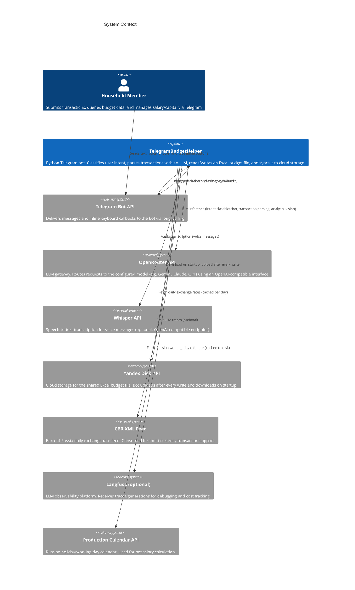
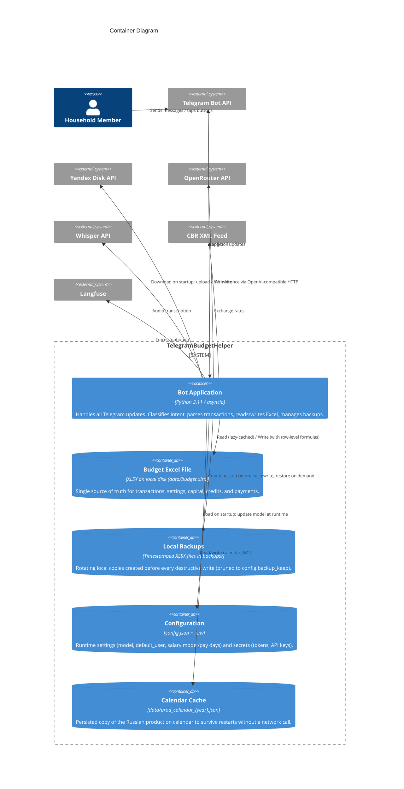

# Architecture

C4 model and request-flow reference for TelegramBudgetHelper.

---

## Level 1 — System Context



---

## Level 2 — Container



---

## Level 3 — Component

```mermaid
C4Component
  title Component Diagram — Bot Application

  System_Ext(telegram_api, "Telegram Bot API")
  System_Ext(openrouter_api, "OpenRouter API")
  System_Ext(yadisk_api, "Yandex Disk")
  System_Ext(cbr_api, "CBR XML Feed")
  System_Ext(whisper_api, "Whisper API")
  System_Ext(langfuse_api, "Langfuse")

  Container_Boundary(app, "Bot Application") {

    Component(bot_entry, "bot.py", "Python module", "Entry point. Registers Telegram handlers, initialises all singletons in post_init, enforces per-user rate limiting (20 req/60 s), routes voice/photo/text/callbacks.")
    Component(dispatcher, "dispatcher.py", "Python module", "Maps IntentClassification → handler call. Holds no state.")
    Component(telegram_helpers, "telegram_helpers.py", "Python module", "Shared send/edit helpers with retry logic and configurable timeouts.")
    Component(config_mod, "config.py", "Python module", "Loads config.json + .env into a Config dataclass. Provides Config.update_model() for runtime model switching.")

    Component(llm_client, "llm/client.py — LLMClient", "Python class", "Wraps OpenRouter via openai.AsyncOpenAI. chat() for plain text, chat_structured() for Pydantic JSON output (instructor), chat_vision() for image+text, transcribe() for Whisper.")
    Component(llm_router, "llm/router.py", "Python module", "Fast regex pre-classifier; falls back to LLM for ambiguous messages. Returns IntentClassification (13 intents).")
    Component(llm_prompts, "llm/prompts.py", "Python module", "Prompt builders: build_transaction_prompt, build_analysis_prompt.")
    Component(llm_agent, "llm/agent.py", "Python module", "run_budget_agent(): tool-calling harness loop (max 6 turns, 15 tool calls, 45 s) with numeric-grounding and Telegram-HTML validation plus canonical fallback.")
    Component(llm_agent_tools, "llm/agent_tools.py", "Python module", "Read-only tool schemas/executors including analyze_cashflow and transparent estimate_leave_impact for paid/unpaid leave.")
    Component(llm_tips, "llm/tips_loader.py", "Python module", "load_tips()/append_tip() for the persistent agent guidance file (data/agent_tips.txt).")
    Component(llm_schemas, "llm/schemas.py", "Python module", "TransactionInput Pydantic schema — structured output contract between LLM and transaction handler.")
    Component(llm_tracing, "llm/tracing.py", "Python module", "Optional Langfuse request/generation tracing with exact output.reply capture and isolated retrying diagnostic reads. No-op when unconfigured.")
    Component(code_executor, "llm/code_executor.py", "Python module", "Legacy sandboxed Python fallback for unknown intents; disabled unless enable_unknown_code_executor=true.")

    Component(h_transaction, "handlers/transaction.py", "Python module", "parse_transaction(): structured LLM parse, confirmed-history category/account defaults (3 matches, 80% majority), then non-RUB conversion.")
    Component(h_analysis, "handlers/analysis.py", "Python module", "answer_question(): handles salary-balance questions deterministically, otherwise builds context dict and calls LLMClient.chat().")
    Component(h_query, "handlers/query.py", "Python module", "Deterministic-first exact aggregates, inclusive expense ranges, historical start-of-day balances, and future start-of-month capital projections.")
    Component(h_edit, "handlers/edit.py", "Python module", "Inline edit/delete flow: shows last 5 transactions, field-level editing, saves via ExcelWriter.")
    Component(h_search, "handlers/search.py", "Python module", "LLM-parsed natural-language search over transactions; results sorted newest-first.")
    Component(h_salary, "handlers/salary.py", "Python module", "cmd_salary: reads salary from settings, calculates next net payment using configured salary model.")
    Component(h_capital, "handlers/capital.py", "Python module", "cmd_update_capital: rebuilds 7-month salary columns in the Capital sheet; future projected balances are returned but not stored in actual-capital col B.")
    Component(h_settings, "handlers/settings_cmd.py", "Python module", "Salary/capital query+update and payments checklist. Capital query projects future months from salary columns minus mandatory payments.")
    Component(h_stats, "handlers/stats.py", "Python module", "cmd_stats: aggregates expense categories for a given month.")
    Component(h_photo, "handlers/photo.py", "Python module", "handle_photo_receipt: base64-encodes image, calls LLMClient.chat_vision() → TransactionInput.")
    Component(h_admin, "handlers/admin.py", "Python module", "Admin commands: /last, /model, /versions, /restore, /sync, /download_excel.")
    Component(h_setup, "handlers/setup.py", "Python module", "Admin-only /setup wizard: writes setup data to the runtime workbook and uploads it.")

    Component(excel_reader, "excel/reader.py — ExcelReader", "Python class", "Caches active transaction views and raw audit entries; computes start-of-day balances from the ledger anchor.")
    Component(excel_writer, "excel/writer.py — ExcelWriter", "Python class", "Append-only transaction, reversal, correction, reconciliation, derived-balance rebuild, and salary projection writes.")
    Component(excel_ledger, "excel/ledger.py", "Python module", "Runtime schema migration, opening anchor, ledger integrity validation, and materialized balance rebuild.")
    Component(excel_setup, "excel/setup.py", "Python module", "Validates public template, scans for private values, creates/updates runtime workbook.")
    Component(excel_constants, "excel/constants.py", "Python module", "Sheet name constants shared by reader and writer.")

    Component(currency, "currency/rates.py", "Python module", "get_rates(): fetches CBR XML, caches per calendar day. convert_to_rub(amount, currency).")
    Component(salary_calc, "salary/calculator.py", "Python module", "calculate_payment(): net salary for next pay date using working-day ratio or fixed percentages.")
    Component(sal_calendar, "salary/calendar_parser.py", "Python module", "fetch_calendar(year): downloads/caches Russian production calendar JSON.")
    Component(backup_mgr, "versioning/backup.py — BackupManager", "Python class", "create(), list_backups(), restore(index). Rotating local XLSX copies.")
    Component(yadisk_sync, "yadisk/sync.py — YadiskSync", "Python class", "download() / upload() with retries. Uses httpx directly against Yandex Disk REST API.")
  }

  Rel(telegram_api, bot_entry, "Update objects (messages, callbacks)")
  Rel(bot_entry, telegram_api, "Replies via telegram_helpers")
  Rel(llm_client, openrouter_api, "HTTPS / OpenAI-compatible")
  Rel(llm_client, whisper_api, "Audio transcription")
  Rel(llm_tracing, langfuse_api, "Trace events")
  Rel(currency, cbr_api, "GET XML_daily.asp")
  Rel(yadisk_sync, yadisk_api, "OAuth REST upload/download")

  Rel(bot_entry, llm_router, "classify_intent(text)")
  Rel(bot_entry, dispatcher, "dispatch(classification, ...)")
  Rel(bot_entry, telegram_helpers, "reply_to_update / _edit_callback_message_with_retries")

  Rel(dispatcher, h_transaction, "intent=transaction")
  Rel(dispatcher, h_query, "question / transaction_search / unknown / dated capital_query (deterministic first)")
  Rel(dispatcher, llm_agent, "unsupported query / optimization_advice / general_financial_advice")
  Rel(dispatcher, h_edit, "intent=transaction_edit")
  Rel(dispatcher, h_search, "intent=transaction_search")
  Rel(dispatcher, h_settings, "intent=salary_* / capital_* / payments_checklist")
  Rel(bot_entry, h_salary, "/salary command")
  Rel(bot_entry, h_capital, "/update_capital command")
  Rel(bot_entry, h_stats, "/stats command")
  Rel(bot_entry, h_photo, "photo message")
  Rel(bot_entry, h_admin, "/last /model /versions /restore /sync /download_excel")

  Rel(h_transaction, llm_client, "chat_structured() → TransactionInput")
  Rel(h_transaction, currency, "convert_to_rub() if non-RUB")
  Rel(llm_agent, llm_client, "chat_with_tools() per turn")
  Rel(llm_agent, llm_agent_tools, "get_tool_schemas() / execute_tool()")
  Rel(llm_agent, llm_tips, "load_tips() into system prompt")
  Rel(llm_agent, llm_tracing, "trace_ctx.child_generation() per turn/tool")
  Rel(llm_agent_tools, excel_reader, "read-only queries")
  Rel(h_search, llm_client, "chat_structured() for query parsing")
  Rel(h_photo, llm_client, "chat_vision() → TransactionInput")
  Rel(llm_router, llm_client, "chat_structured() for non-trivial classification")

  Rel(h_transaction, excel_reader, "get_settings() for categories/accounts")
  Rel(h_edit, excel_reader, "get_last_transactions(5)")
  Rel(h_edit, excel_writer, "correct_transaction() / reverse_transaction()")
  Rel(h_search, excel_reader, "get_transactions()")
  Rel(h_settings, excel_reader, "get_settings() / get_capital_data()")
  Rel(h_settings, excel_writer, "update_salary() / reconcile_capital()")
  Rel(h_capital, excel_writer, "update_capital_salary()")
  Rel(h_stats, excel_reader, "get_transactions()")
  Rel(excel_reader, excel_constants, "sheet name constants")
  Rel(excel_writer, excel_constants, "sheet name constants")

  Rel(bot_entry, backup_mgr, "create() before every write")
  Rel(bot_entry, yadisk_sync, "upload() after every confirmed write")
  Rel(h_capital, yadisk_sync, "upload() after update_capital_salary()")
  Rel(h_salary, salary_calc, "calculate_payment()")
  Rel(h_capital, salary_calc, "calculate_payment() × 7 months")
  Rel(salary_calc, sal_calendar, "fetch_calendar(year)")
```



---

## Request flows

### Transaction (text)

```
User message
  → bot.py:on_message
    → rate-limit check (20 req/60 s per user)
    → global allowed_users guard (unauthorized updates stop silently)
    → edit-mode check (_pending_edit[user_id])
    → llm/router.py:classify_intent  [fast regex OR LLM structured output]
      → intent = "transaction"
    → dispatcher.py:dispatch
      → no numeric amount → clarification reply (route=transaction_clarification), no pending state
      → numeric amount → handlers/transaction.py:parse_transaction
          → llm/prompts.py:build_transaction_prompt
          → llm/client.py:chat_structured → TransactionInput
          → currency/rates.py:convert_to_rub  (if non-RUB)
      → Inline confirm keyboard sent (token stored in _pending, TTL 600 s)
  ← User taps "✅ Да"
    → bot.py:on_callback
      → versioning/backup.py:BackupManager.create()
      → excel/writer.py:append_transaction_and_adjust_capital()
      → excel/reader.py:invalidate_cache()
      → yadisk/sync.py:upload()  [async background task]
```

### Voice message

```
Voice message
  → bot.py:on_voice
    → Telegram file download
    → llm/client.py:transcribe → Whisper API → text
  → (same path as text from classify_intent onward)
```

### Photo receipt

```
Photo message
  → bot.py:on_photo
    → handlers/photo.py:handle_photo_receipt
        → Download highest-resolution photo
        → Base64 encode
        → llm/client.py:chat_vision → TransactionInput
  → Inline confirm keyboard (same confirm flow as text transaction)
```

### Budget analytics query (deterministic first)

```
User question
  → classify_intent
    → expense day range fast rule → intent=question (no router LLM call)
    → exact data intent → query planner fast rules / structured BudgetQueryPlan
      → handlers/query.py executes against ExcelReader
      → operations include expense_period_summary, balance_at_date, projected_capital
      → named month without a day resolves to day 1
      → past/current target uses ledger history; future target uses planned flows only
    → unsupported/advice → llm/agent.py:run_budget_agent
        → build system prompt (static rules + tips_loader tips + volatile date/user)
        → loop (≤ 6 turns, ≤ 15 tool calls, ≤ 45 s wall-time):
            → llm/client.py:chat_with_tools(messages, tools)
            → if tool calls: execute in parallel via llm/agent_tools.py:execute_tool
                (search_transactions, aggregate_transactions, category_breakdown,
                 monthly_trend, get_capital, get_salary, get_mandatory_payments,
                 get_credits, analyze_cashflow, estimate_leave_impact; optional run_python_code when enabled)
              → append observations (truncated to 3 000 chars), repeat
            → else: return final HTML answer
```

All agent tools are read-only against `ExcelReader`. The agent never writes.

Vacation/leave wording bypasses balance, payments, and transaction routes. Common same-month date ranges execute `estimate_leave_impact` directly; vacation-plus-capital questions also execute `get_capital`, avoiding stochastic tool-selection failures. The estimate resolves the configured household member, treats salary settings as net, supports one explicitly named unpaid period, and preserves proxy-estimate limitations. Common “where did money go / how much can I save?” phrases execute `analyze_cashflow` directly; other compound advice can still select it through the agent.

Before returning an agent response, `llm/agent.py` verifies that every numeric claim appears in the question or tool evidence and that only supported, balanced Telegram HTML is used. It retries synthesis once, then returns escaped canonical tool evidence if validation still fails.

Expense ranges are inclusive at both boundaries and force `type=Расход`, so income rows never enter their total or operation list. Forms using `траты`, `расходы`, or `потратил` take precedence over incidental balance words such as `денег`. The router classifies their bare imperative form as `question`, while dispatcher independently redirects the same shape to deterministic execution even if an upstream classifier reports `transaction`; no pending confirmation is created. `unknown` intents use the same deterministic-first path. A dated balance phrase likewise overrides an incorrect router intent. If a structured LLM plan labels a future date as `balance_at_date`, the query service normalizes it to the separate `projected_capital` operation before execution.

Before transaction parsing, dispatcher requires a numeric amount candidate. If the LLM router reports `transaction` for text without one, the bot records `route=transaction_clarification`, asks the user to add an amount, and leaves `_pending` unchanged. This prevents accidental zero-value ledger confirmations.

Transaction search is intentionally single-message. When its deterministic plan is unsupported because no criterion was supplied, dispatcher records `route=transaction_search_clarification` and asks for a complete phrase such as “найди транзакцию: билет”. It does not invoke the budget agent or imply that a later standalone word will inherit conversational search context.

For a future month, projection starts from the current month’s materialized net capital and applies salary columns L–M minus mandatory payments for complete intervening months. Thus a projection for 1 December includes planned flows through November and excludes December flows.

### Request tracing

`start_trace()` creates the root Langfuse request span with `input.text`. The dispatcher adds `intent`, stable `route`, and `answer_source`; deterministic plans add `query_plan`, while answer validation may add `quality_flags`. Salary, payment-checklist, transaction-edit, update, agent, and current-capital paths all use the shared trace-aware reply helper. It writes exact `output.reply` before `finish()` closes and flushes the root span. `finish()` does not replace an already-recorded output.

`llm.tracing.read_trace_for_diagnostics()` provides bounded retries and an explicit read timeout for smoke-test inspection through the Langfuse public API. It is isolated from bot request handling and returns `None` on failure.

`scripts/audit_langfuse_answers.py` performs a bounded read-only audit and prints only trace IDs, timestamps, and quality flags—never questions, replies, user metadata, or financial values.

### Edit/delete transaction

```
User intent = transaction_edit/delete
  → handlers/edit.py
    → display last 5 transactions newest-first (inline keyboard)
    ← User selects a transaction
    → Edit: show current state + field buttons (description, amount, date, category,
             type, whose, account, mandatory). Tapping a field shows label + current value.
             User sends new value → updates in-memory draft → returns to preview.
             edit_save:0 → ExcelWriter.correct_transaction() (reversal + replacement)
    → Delete: show current state + delete/cancel buttons
              delete_confirm:<entry_id> → ExcelWriter.reverse_transaction()
```

---

## Key module descriptions

### LLM layer (`llm/`)

| Module | Role |
|---|---|
| `client.py` | Wraps OpenRouter via `openai.AsyncOpenAI`. `chat_structured()` uses `instructor`; `chat_with_tools()` is the native tool-calling API used by the agent loop. |
| `router.py` | Fast regex pre-classifier; falls back to LLM structured output for ambiguous messages. Returns one of 13 `IntentClassification` values. |
| `schemas.py` | `TransactionInput` Pydantic model — structured output contract. `whose` is a string; `original_currency`/`original_amount` capture LLM-detected currency; `amount` is always RUB after `parse_transaction()`. |
| `agent.py` | `run_budget_agent()` harness: max 6 turns, 15 tool calls, 45 s. Static+tips portion of the system prompt is cache-friendly; volatile date/user is appended last. |
| `agent_tools.py` | Read-only tool schemas/executors: `analyze_cashflow`, transaction queries, capital/settings reads, and `estimate_leave_impact`. |
| `prompts.py` | `build_transaction_prompt` treats payments/gifts for another person as payer's expense; recipient goes to `description` in parentheses, e.g. `Угостил кофе (<Получателя>)`. Category is chosen from the categories available in the Excel workbook. |
| `tracing.py` | Optional Langfuse tracing. Root spans keep input, routing metadata, and exact `output.reply`; `finish()` preserves recorded output. No-op when unconfigured; retries transient init failure. Diagnostic trace reads have independent retry/read-timeout bounds. |
| `tips_loader.py` | `load_tips(path)` / `append_tip(tip, path)` for `data/agent_tips.txt`. Agent reads all non-comment lines on every invocation. |

### Excel layer (`excel/`)

| Module | Role |
|---|---|
| `constants.py` | Sheet name constants (`SHEET_TRANSACTIONS`, `SHEET_SETTINGS`, `SHEET_CREDITS`, `SHEET_PAYMENTS`, `SHEET_CAPITAL`). Single source of truth used by both reader and writer. |
| `reader.py` | Lazy-loads and caches the workbook. `invalidate_cache()` must be called after every write. `get_last_transactions(n)` returns newest-first by transaction date then Excel row number. Credit numeric fields tolerate `29.9%`, `29,9%`, and values with spaces. |
| `writer.py` | Appends rows to `📋 Транзакции` (row 3+). Writes A–I, copies derived J–K formulas from the nearest previous formula row with translated row references. Never generates participant/account/share formulas from hardcoded names. `update_capital_salary()` writes cols L–O and clears future col B values. |
| `ledger.py` | Migrates runtime workbooks, maintains stable IDs/audit entries and the opening anchor, validates reversal links, and rebuilds `balance_after` plus current capital. |
| `setup.py` | Validates the public template, scans for private values, creates the runtime workbook from the template. Writes setup values only to `BUDGET_FILE_PATH`. |

### Supporting modules

| Module | Role |
|---|---|
| `currency/rates.py` | Fetches CBR XML feed, caches per calendar day. Previous day's cache used on network failure. `convert_to_rub(amount, currency)` — RUB/₽/РУБ is a no-op (rate=1.0). Unknown currencies raise `ValueError`. |
| `salary/calculator.py` | `calculate_payment()` — net salary for the next configured pay date using working-day ratio or fixed percentages. |
| `salary/calendar_parser.py` | `fetch_calendar(year)` — downloads and caches the Russian production calendar to `data/prod_calendar_{year}.json`. Falls back to `{}` (all days treated as working) if fetch fails and no cache exists. |
| `versioning/backup.py` | Rotating local backups in `backups/`, pruned to `config.backup_keep`. |
| `yadisk/sync.py` | `download()` / `upload()` with retries via `httpx` (not the `yadisk` library). |

---

## External dependencies

| System | Protocol | Auth | Purpose |
|---|---|---|---|
| Telegram Bot API | HTTPS long-poll | Bot token | Message delivery and inline keyboards |
| OpenRouter API | HTTPS / OpenAI-compatible | API key (Bearer) | LLM inference (chat, structured output, vision) |
| Whisper API | HTTPS / OpenAI-compatible | API key | Voice transcription (optional) |
| Yandex Disk API | HTTPS REST | OAuth token | Excel file cloud storage |
| CBR XML Feed | HTTPS | None | Daily RUB exchange rates |
| Langfuse | HTTPS | Public/secret key pair | LLM tracing (optional) |
| Production calendar | HTTPS | None | Russian working-day calendar for `working_days` salary calc |

---

## Callback data conventions

Pending confirmations are stored in `_pending: dict[str, tuple[object, float]]` in `bot.py`, keyed by UUID token. Confirmations older than 600 s are rejected. A background loop prunes stale entries every 5 minutes.

| Callback format | Meaning |
|---|---|
| `confirm:<token>` / `cancel:<token>` | Regular transaction confirm/cancel |
| `edit_select:<row_num>` | Select transaction for editing |
| `edit_field:<field>` | Choose field to edit |
| `edit_save:0` / `edit_cancel:0` | Save or cancel edit |
| `delete_select:<row_num>` | Select transaction for deletion |
| `delete_confirm:<row_num>` / `delete_cancel:0` | Confirm or cancel delete |
